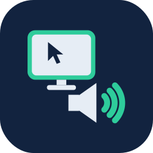

# &nbsp;&nbsp;LAN Media Streaming

Low-latency screen and audio streaming from a Windows PC to an Android display,
entirely over your local network. No cloud, no accounts, nothing leaves the
building.

Built for classrooms — mirror a teacher's Windows PC onto a wall-mounted
Android panel — but useful anywhere you want a private, self-hosted "wireless
HDMI" over Wi-Fi or Ethernet.

* **LAN-only.** Discovery, control, and media all stay on your subnet. No
  internet, no telemetry.
* **Encrypted.** Optional TLS with trust-on-first-use certificate pinning.
* **Hardware-accelerated.** H.264 via AMD AMF or Intel Quick Sync, with a
  software (libx264) fallback.
* **Audio + video, in sync.** Opus audio muxed with the video and aligned on a
  shared playout clock.
* **FOSS.** MIT-licensed (see [LICENSE](LICENSE) and
  [THIRD-PARTY-NOTICES.md](THIRD-PARTY-NOTICES.md)).

## Repository layout

```
windows-sender/    LAN Media Sender — Windows (.NET 8 / WinForms) capture-and-stream app
android-receiver/  LAN Media Receiver — Android app that displays the stream
```

Each folder has its own README with detailed build and run instructions.

## How it works

The **sender** captures the primary display with DXGI Desktop Duplication (GPU,
~2 ms/frame; falls back to GDI if unavailable), encodes it to H.264 with FFmpeg
using a hardware encoder when one is present, captures system audio via WASAPI
loopback and encodes it to Opus, then muxes both into a single TCP stream.

The **receiver** listens for the sender, decodes H.264 with Android's MediaCodec
straight onto a full-screen surface, decodes Opus to an AudioTrack, and keeps
the two in sync on a shared timeline with a small buffered delay.

Panels announce their name over UDP so the sender can find them without you
typing an IP; an IP fallback is available for networks where broadcast is
blocked.

### Ports (local network only)

| Port  | Protocol | Purpose                          |
|-------|----------|----------------------------------|
| 45788 | TCP      | Media stream (audio + video)     |
| 45789 | UDP      | Name discovery                   |

## Quick start

1. **Receiver** — build and install `android-receiver/` on your Android panel
   (Android 8.0 / API 26+), open it, and note the name it shows (e.g.
   `Rcvr-482`). Optionally set a password.
2. **Sender** — build `windows-sender/` (or run a published build), place the
   required FFmpeg 7.1 shared DLLs next to the executable (see that folder's
   README), enter the receiver's name or IP and the matching password, pick your
   options, and click **Start streaming**.
3. On the first encrypted connection the receiver's certificate is pinned;
   verify the fingerprint once and it's remembered thereafter.

See the per-app READMEs for full build steps, dependencies, and troubleshooting.

## Tested hardware

Developed and tested on a GMKtec NucBox G5 (Intel Alder Lake N97) — streaming to
a Samsung Galaxy Tab A9, to simulate a Newline Android panel. Any Windows 10/11
PC with a hardware H.264 encoder (or enough CPU for the software fallback) and 
any Android 8.0+ display should work.

## Privacy

This project was built for K-12 use, where student-data privacy is
non-negotiable. There is no telemetry, no analytics, no cloud service, and no
third-party network call. Everything happens on your local network; the only
data transmitted is the screen/audio stream itself, to the receiver you choose,
optionally encrypted.

## License

MIT — see [LICENSE](LICENSE). Bundled and referenced third-party components
(FFmpeg, NAudio, Concentus, Vortice, AndroidX, and others) remain under their
own licenses; see [THIRD-PARTY-NOTICES.md](THIRD-PARTY-NOTICES.md).

## Credits

Design guidance and testing by Mike Young. Programmed by Anthropic Claude
(Opus 4.8).
