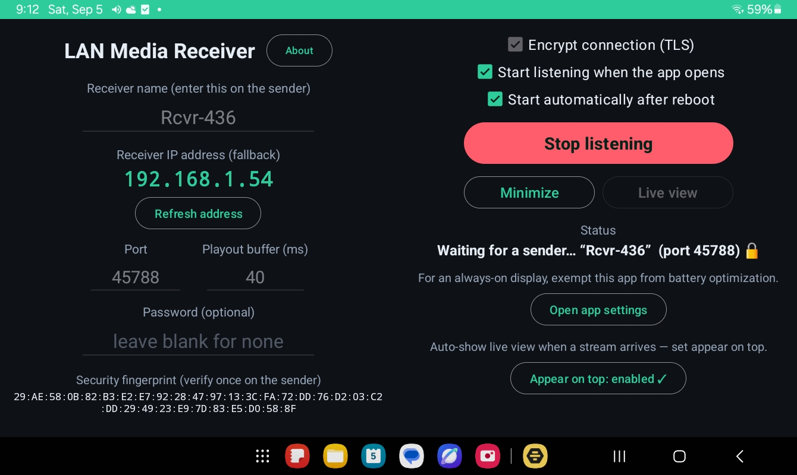
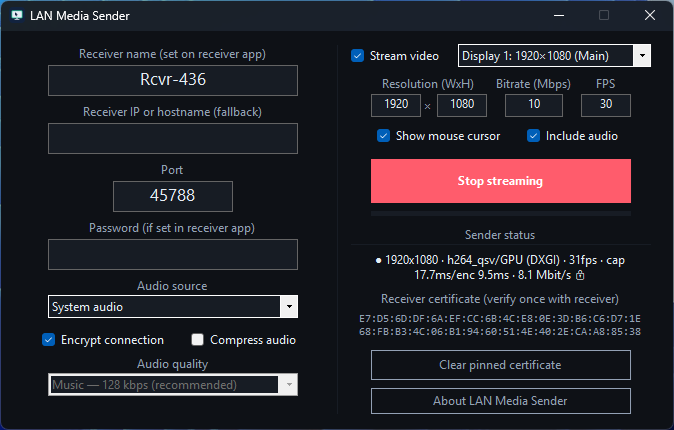

# &nbsp;&nbsp;LAN Media Streaming

Low-latency screen and audio streaming from a Windows PC to an Android panel or
Linux PC, entirely over your local network. No cloud, no accounts, nothing
leaves the building.

Built for classrooms — mirror a teacher's Windows PC onto a wall-mounted
Android panel or a repurposed PC — but useful anywhere you want a private,
self-hosted "wireless HDMI" over Wi-Fi or Ethernet.

* **LAN-only.** Discovery, control, and media all stay on your subnet. No
  internet, no telemetry.
* **Encrypted.** Optional TLS with trust-on-first-use certificate pinning.
* **Hardware-accelerated.** H.264 via AMD AMF or Intel Quick Sync on the sender,
  with a software (libx264) fallback.
* **Android or Linux receivers.** Display on a wall-mounted Android panel or a
  Linux PC. The Linux receiver is a small C service (SDL2 + FFmpeg + OpenSSL)
  with VAAPI GPU decode and automatic software fallback — good for turning an
  old laptop or mini-PC into a panel.
* **Configurable video.** Set the output resolution, H.264 bitrate, and frame
  rate (up to 60 fps) on the sender, or leave the defaults (1920×1080, 10 Mbps,
  30 fps). Resolution acts as a bounding box: the screen is scaled to fit it,
  aspect ratio preserved, and never upscaled beyond your display's own
  resolution.
* **Multi-monitor aware.** On a PC with more than one display, pick which one to
  capture from a dropdown on the sender (defaults to the main display).
* **Flexible addressing.** Find a receiver by its announced name, or — when
  broadcast discovery is blocked — by hostname (including mDNS `name.local`) or a
  literal IP, so you never have to chase a DHCP-assigned address.
* **Audio + video, in sync.** Opus audio muxed with the video and aligned on a
  shared playout clock.
* **Tunable latency.** An adjustable playout buffer (20–500 ms, default 150)
  trades smoothness for responsiveness — dial it low on wired Ethernet for
  snappy, near-real-time video, or keep it higher on Wi-Fi to ride out jitter.
  The minimum tracks the stream's frame rate (20 ms at 60 fps, 40 ms at 30 fps)
  so playback never drops below a single frame.
* **Hands-free display.** The panel brings the live view up on its own the moment
  the PC starts streaming — waking the panel if it was asleep — then returns to
  standby when the stream stops. No touching the panel.
* **FOSS.** MIT-licensed (see [LICENSE](LICENSE) and
  [THIRD-PARTY-NOTICES.md](THIRD-PARTY-NOTICES.md)).

## Screenshots

<p align="center">
  
  
  <br>
  <sub>LAN Media Receiver app on an Android device (left), and LAN Media Sender application on Windows (right)</sub>
</p>

## Downloads

Prebuilt binaries are hosted off-GitHub (not stored in this repository). Each
`.zip` bundles its own `LICENSE.txt`, `THIRD-PARTY-NOTICES.txt`, and `README.txt`.

- **LAN Media Sender — Windows:** [download zip](https://www.mikesshorts.com/misc/lms/LAN_Media_Sender_Windows_Binary.zip) — also requires FFmpeg 7.x, obtained separately (see the README inside the zip).
  SHA-256: `88b0a8fd87eed56a6a4ac60c200d08b4f226d34f4d5d39fe9562f10ea12b4796`
- **LAN Media Receiver — Android:** [download zip](https://www.mikesshorts.com/misc/lms/LAN_Media_Receiver_Android_Binary.zip)
  SHA-256: `157d6df99f1eb4ce3ff279e7c4225f037e5d216be6422aa9e3d2d84d41f414e6`

The **Linux receiver** has no prebuilt download — build it from source in
`linux-receiver/` (a couple of `apt` packages plus `make`; see its README).

**Verify your download (optional).** Confirm the file's SHA-256 matches the value above:

- Windows (PowerShell): `Get-FileHash "LAN_Media_Sender_Windows_Binary.zip" -Algorithm SHA256`
- macOS / Linux: `shasum -a 256 "LAN_Media_Sender_Windows_Binary.zip"`

Prefer to build it yourself? See the per-app folders below.

## Repository layout

```
windows-sender/    LAN Media Sender — Windows (.NET 8 / WinForms) capture-and-stream app
android-receiver/  LAN Media Receiver — Android app that displays the stream
linux-receiver/    LAN Media Receiver — Linux (C / SDL2 / FFmpeg) service + GTK settings app
```

Each folder has its own README with detailed build and run instructions.

## How it works

The **sender** captures a display with DXGI Desktop Duplication (GPU, ~2 ms/frame;
falls back to GDI if unavailable) — the main display by default, or any monitor
you pick on a multi-monitor PC — encodes it to H.264 with FFmpeg using a hardware
encoder when one is present, captures system audio via WASAPI loopback and encodes
it to Opus, then muxes both into a single TCP stream. The output resolution,
bitrate, and frame rate are all adjustable on the sender.

The **Android receiver** listens for the sender, decodes H.264 with Android's
MediaCodec straight onto a full-screen surface, decodes Opus to an AudioTrack,
and keeps the two in sync on a shared timeline with a small, adjustable buffered
delay (the receiver's **Playout buffer** setting — lower for wired/low-latency,
higher for Wi-Fi/smoothness). The buffer's minimum adapts to the stream's frame
rate — as low as 20 ms at 60 fps — so it can be set tight without ever starving
the decoder below one frame.

The **Linux receiver** does the same on a PC: a lean C service that decodes
H.264 with FFmpeg — on the GPU via VAAPI when the hardware supports it, in
software otherwise (detected automatically, with fallback) — and displays
fullscreen with SDL2. It speaks the identical protocol (name discovery, TLS
pinning, the same fps-aware playout buffer), pops the stream up on connect, and
can be launched at login through the desktop's autostart for a hands-free panel.
A small GTK settings app sets the name, port, password, buffer, and decode mode.
It's a natural way to reuse an old laptop or mini-PC as a display.

While a receiver is listening, it sits quietly in the background and brings the
full-screen live view forward on its own when a stream begins (waking the display
if it was asleep), then drops back to standby when the stream ends — so a
wall-mounted panel needs no interaction. On Android this uses the "appear on top"
(display-over-other-apps) permission, granted once from a button in the receiver;
without it, the app falls back to a full-screen notification the user taps, and a
**Live view** button on the main screen jumps back to the running stream at any
time. On Linux the same hands-free behavior comes from running the receiver in
your desktop session (via autostart), where it opens the fullscreen window on
connect.

### Finding the receiver

The sender can reach a panel three ways, in order of convenience:

1. **By name (default).** Type the receiver's name (e.g. `Rcvr-482`); panels
   announce it over UDP broadcast and the sender resolves the address for you.
2. **By hostname (workaround).** If UDP discovery is blocked — some managed
   networks filter broadcast, or the sender and panel sit on different subnets —
   put the panel's hostname in the sender's **"Receiver IP or hostname"** field
   instead. A machine hostname or an mDNS `hostname.local` both work (the sending
   PC resolves it through normal DNS/mDNS), which also avoids hunting down a
   panel's DHCP-assigned IP. On a Linux panel, installing `avahi-daemon` gives it
   a dependable `hostname.local`.
3. **By IP.** A literal IP address in the same field always works; pair it with a
   DHCP reservation for a fixed, network-independent address.

### Ports (local network only)

| Port  | Protocol | Purpose                          |
|-------|----------|----------------------------------|
| 45788 | TCP      | Media stream (audio + video)     |
| 45789 | UDP      | Name discovery                   |

## Quick start

1. **Receiver** — pick one:
   - *Android:* build and install `android-receiver/` on your panel (Android 8.0
     / API 26+), open it, and note the name it shows (e.g. `Rcvr-482`). Optionally
     set a password. For a hands-free wall panel, tap the **appear on top** button
     once so the live view can pop up automatically.
   - *Linux:* build `linux-receiver/` on any x86-64 Linux PC (one `apt` line plus
     `make`; see its README), run the settings app to set the name/password, and
     optionally add it to your desktop's autostart. It appears to the sender
     exactly like any other receiver.
2. **Sender** — build `windows-sender/` (or run a published build), place the
   required FFmpeg 7.1 shared DLLs next to the executable (see that folder's
   README), enter the receiver's name — or its hostname or IP (see *Finding the
   receiver*) — and the matching password, choose the display to capture and your
   video options (resolution, bitrate, frame rate — or keep the defaults), then
   click **Start streaming**.
3. On the first encrypted connection the receiver's certificate is pinned;
   verify the fingerprint once and it's remembered thereafter.

See the per-app READMEs for full build steps, dependencies, and troubleshooting.

## Performance notes

The defaults (1080p, 10 Mbps, 30 fps, 150 ms buffer) are tuned to work well on
ordinary classroom Wi-Fi. The higher settings are best paired with wired
Ethernet: a 60 fps stream, resolutions above 1080p, or bitrates much above
~15 Mbps push more data than a shared access point comfortably carries, and a
very low playout buffer leaves no room to absorb Wi-Fi jitter. A 4K/60 panel on
gigabit Ethernet is a different story — there the panel's own H.264 decoder
(its supported profile/level), not the network, is the limit.

On the Linux receiver, hardware (VAAPI) decode matters most on weak CPUs — an
old Chromebook or Atom-class machine may need it for smooth 1080p — while a
stronger laptop can decode 1080p30 in software comfortably. Either way the
receiver detects what's available and falls back automatically, so the same
build runs across a mix of old hardware.

## Tested hardware

Developed and tested on a GMKtec NucBox G5 (Intel N95 CPU), streaming to a
Samsung Galaxy Tab A6, simulating a Newline Android-based interactive panel. Any
Windows 10/11 PC with a hardware H.264 encoder (or enough CPU for the software
fallback) and any Android 8.0+ display should work.

The **Linux receiver** targets x86-64 Linux and was developed on Lubuntu 24.04.
It runs on modest, repurposed hardware — old laptops and mini-PCs — using VAAPI
hardware H.264 decode where the GPU/driver expose it, and software decode
otherwise.

## Privacy

This project was built for K-12 use, where student-data privacy is
non-negotiable. There is no telemetry, no analytics, no cloud service, and no
third-party network call. Everything happens on your local network; the only
data transmitted is the screen/audio stream itself, to the receiver you choose,
optionally encrypted.

## License

MIT — see [LICENSE](LICENSE). Bundled and referenced third-party components
(FFmpeg, NAudio, Concentus, Vortice, AndroidX, SDL2, libopus, OpenSSL, and
others) remain under their own licenses; see
[THIRD-PARTY-NOTICES.md](THIRD-PARTY-NOTICES.md).

## Credits

Design guidance and testing by Mike Young. Programmed by Anthropic Claude
(Opus 4.8).
